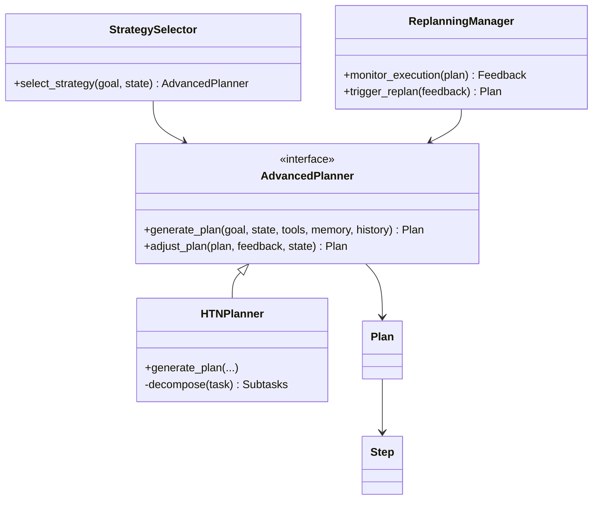

# Advanced Planner Design Document

## 1. Research & Proposed Strategies

The Advanced Planner will support multiple planning paradigms:

- **Hierarchical Task Networks (HTN):** Enables decomposition into subtasks based on domain operators.  
- **Goal Decomposition / Means-Ends Analysis:** Breaks down goals iteratively by analyzing preconditions and effects.  
- **Feedback-Driven Replanning Loops:** Allows dynamic plan updates based on execution feedback.  
- **Tool-Aware Planning:** Plans with explicit steps to invoke agents or plugins as needed.  

For each strategy, we will evaluate strengths, weaknesses, and trade-offs.

## 2. Interface Definition

**Inputs:**

- `goal: str` — Describes the objective to achieve.  
- `current_state: Dict[str, Any]` — Represents the system or environment context.  
- `available_tools: List[ToolSpec]` — Metadata for agents and plugins usable by the plan.  
- `memory_interface: MemoryInterface` — API to read/write project memory.  
- `plan_history: Optional[List[Plan]]` — Records of previous plan executions.  

**Outputs:**

- `Plan` object:
  - `steps: List[Step]` — A sequence of actionable steps.  
  - `dependencies: Dict[str, List[str]]` — Mapping of step IDs to prerequisites.  
  - `assignments: Dict[str, str]` — Mapping of step IDs to assigned agents/tools.  
  - `metadata: Dict[str, Any]` — Plan ID, timestamps, chosen strategy.  

## 3. Architecture Overview

Key modules and classes:

- `AdvancedPlanner` (abstract base class)  
- `HTNPlanner` (implements HTN-based decomposition)  
- `ReplanningManager` (monitors execution, triggers replanning)  
- `StrategySelector` (chooses planner implementation per context)  
- Data models: `Plan`, `Step`  

## 4. Integration Points

- **Orchestrator:** Calls `generate_plan` and dispatches `Plan.steps` to agents.  
- **Memory:** Planner uses `memory_interface` for context and stores plan metadata.  
- **Evaluation Framework:** Feeds execution results back into `adjust_plan`.  

## 5. Dynamic Adjustment & Replanning

- Execution monitored by `ReplanningManager`.  
- Feedback loop:
  1. Agents report success/failure per `Step`.  
  2. `EvaluationFramework` scores outcomes.  
  3. `AdvancedPlanner.adjust_plan` refines or resumes plan.  
- Supports pausing, merging partial plans, and resume.  

---

*Document generated on 2025-04-29 16:12:00*