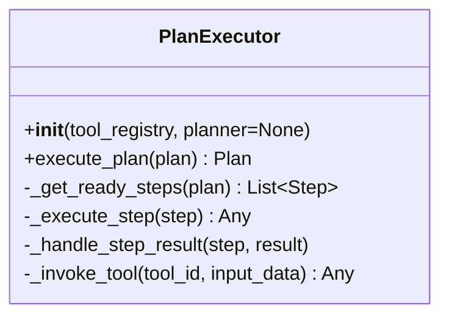

# PlanExecutor Design Document

## 1. Overview
- **Purpose:** The `PlanExecutor` orchestrates execution of `Plan` objects by managing step dependencies, tool invocation, and result handling.
- **Inputs:** 
  - `plan: Plan` — The plan to execute.
  - `tool_registry: PluginManager` — Registry for resolving tools/agents by ID.
  - `planner: Optional[AdvancedPlanner]` — Planner for potential plan adjustments on failures.
- **Outputs:**
  - Updated `plan` with `Step.status` and `Step.output_data` populated.

## 2. Responsibilities
- Determine ready steps based on dependencies.
- Invoke the correct tool/agent for each step.
- Manage step and plan status (`pending`, `running`, `completed`, `failed`).
- Handle execution results and errors.
- Trigger replanning or signal failures back to the planner or orchestrator.

## 3. Class Structure

## 4. Key Methods
### __init__(tool_registry, planner=None)
Initializes with a tool registry and optional planner for adjustments.

### execute_plan(plan)
1. Loop until all steps are completed or a terminal failure occurs.  
2. Retrieve ready steps (`_get_ready_steps`).  
3. For each ready step:
   - Set status to `running`.  
   - Execute via `_execute_step`.  
   - Handle result with `_handle_step_result`.  
4. Return the updated plan.

### _get_ready_steps(plan)
Returns all `pending` steps whose prerequisites are `completed`.

### _execute_step(step)
Invokes the assigned tool:
1. Lookup tool via `tool_registry.get_tool(step.assigned_agent_tool_id)`.  
2. Pass `step.input_data` to the tool.  
3. Return raw result or raise error.

### _handle_step_result(step, result)
- On success: 
  - Set `step.status = "completed"`.  
  - Store `result` in `step.output_data`.  
- On failure:
  - Set `step.status = "failed"`.  
  - Capture error details.  
  - If `planner` is provided, call `planner.adjust_plan(plan, feedback)`.

### _invoke_tool(tool_id, input_data)
Helper to resolve and call tools/agents by ID.

## 5. Dependencies
- `PluginManager` (or `ToolRegistry`) for tool lookup.
- `AdvancedPlanner` interface for `adjust_plan`.
- Optional `Orchestrator` for higher-level coordination.
- Logging framework.

## 6. Execution Flow
1. Initialize all steps to `pending`.  
2. While there are pending steps:
   a. Identify ready steps.  
   b. Execute each ready step sequentially.  
   c. Update statuses and collect results.  
   d. If a step fails, handle replanning or abort.  
3. Mark plan as `completed` if all steps succeed.  
4. Return final plan object.

## 7. Failure Handling & Feedback Loop
- On step failure, aggregate error info.  
- Use `planner.adjust_plan` to refine plan or generate recovery steps.  
- Alternatively, raise an exception or signal orchestrator for manual intervention.

## 8. Concurrency Considerations
- Initial design: sequential execution for simplicity.  
- Future extension: parallel execution of independent ready steps using thread or async pool.  
- Ensure thread-safe status updates and result handling.

---
_Document generated on 2025-04-29._